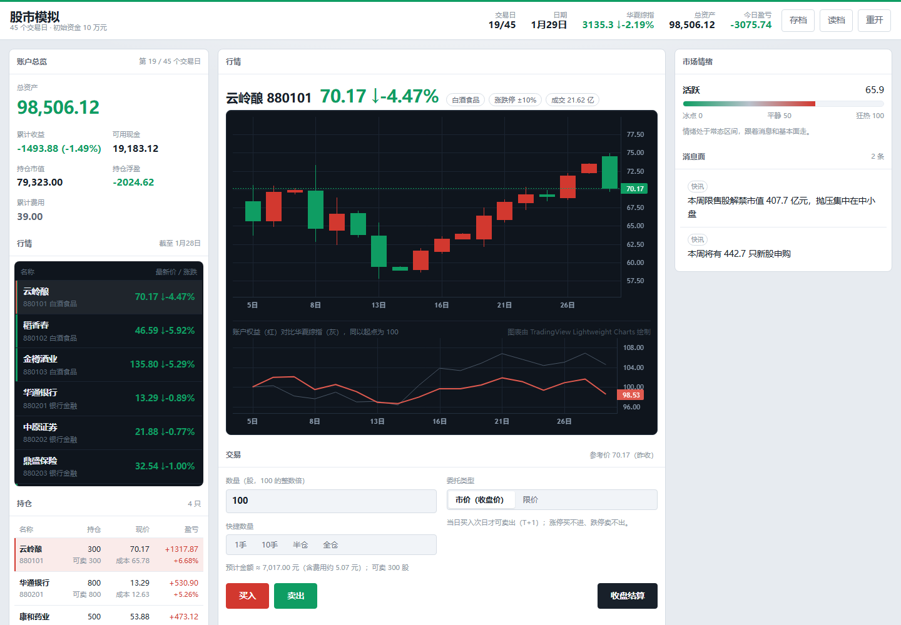
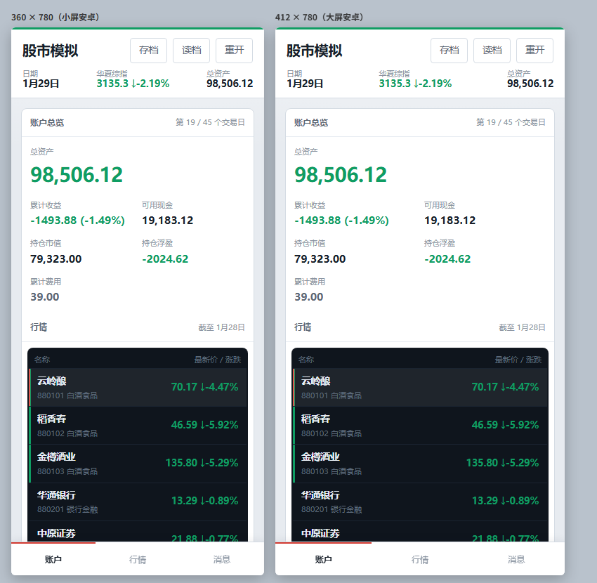

# 股市模拟

一个跑在浏览器里的 A 股投资模拟游戏。给你 10 万元本金和 45 个交易日，看最后能剩下多少。

整个游戏就是一个 HTML 文件，双击就能玩，不需要安装任何东西。



## 玩法

你是一名普通股民。市场里有 30 只虚构股票、10 个行业和一条完整的大盘。每个交易日你会先看到当天的消息面，然后决定买什么、买多少，点「收盘结算」进入下一天。

45 个交易日结束后，按**相对华夏综指的超额收益**评级：

| 相对基准超额 | 称号 |
| --- | --- |
| 高于 +20% | 股神 |
| +10% ~ +20% | 老手 |
| +3% ~ +10% | 跑赢大盘 |
| −3% ~ +3% | 与大盘同步 |
| −10% ~ −3% | 交学费的韭菜 |
| 低于 −10% | 韭菜之王 |

## 规则

规则尽量贴近真实 A 股，其中几条会直接影响你的决策：

- **决策发生在收盘之前。** 下单时你看不到当天的价格。这样"预测"才是游戏内容，而不是事后诸葛。
- **T+1。** 当日买入的股票次日才可卖；卖出所得的资金当日就能再买。
- **两种委托。** 市价单按当日收盘价成交；限价单按当日最低/最高价判断是否触发，可选当日或 3 日有效，随时可撤。
- **涨跌停按板块。** 主板 ±10%，创业板与科创板 ±20%，出事后变 ST 收窄到 ±5%。
- **涨停买不进，跌停卖不出。** 跌停时你想割肉也可能割不掉——这是本作最想让你体验的一件事。
- **交易成本。** 佣金万分之 2.5（最低 5 元）、卖出印花税 0.05%、过户费，外加按订单占当日成交额比例计算的滑点。碎单会被最低佣金惩罚。
- **空仓计息。** 现金按年化 1.5% 计息，让"等待"成为一个真实选项。
- 无杠杆、无做空。

## 启动

### 一、直接打开

双击 `股市模拟.html`。

### 二、本地服务

```bash
npm install        # 装本地图表库与测试依赖，可选
npm run serve      # 打开 http://127.0.0.1:8080/
```

端口可以用环境变量改：`$env:PORT=9000; npm run serve`（Windows）或 `PORT=9000 npm run serve`。

### 三、克隆后先装依赖

如果你是从 Git 克隆下来的，`npm install` 之后双击打开，图表走本地文件，完全不需要联网。

### 图表库的三级加载

图表按 **本地 `node_modules` → jsDelivr CDN → unpkg CDN → 内置 Canvas 简易图** 的顺序加载，任何一级失败就自动降级：

| 情况 | 结果 |
| --- | --- |
| 装了依赖，双击打开 | 走本地库，完整 K 线，不需要联网 |
| 没装依赖，但能联网 | 走 CDN |
| 没装依赖，也没有网 | 退回内置的 Canvas 简易 K 线图——一样能玩，只是图表朴素 |

游戏逻辑本身不依赖任何外部资源，所以**断网也能完整玩完一局**。

### 环境要求

- **玩游戏**：任意现代浏览器（Chrome / Edge / Safari 15+ / Firefox），不需要 Node。
- **跑服务与测试**：Node.js 20.19+ / 22.13+ / 24+（jsdom 的要求）。

### 打包成桌面应用

想把游戏做成一个能拷给别人的 exe：

```bash
npx neu update              # 一次性下载 Neutralino 运行时，约 8 MB
npm run neutralino:build    # 产出 dist/StockSim/StockSim-win_x64.exe
```

产物是**单个自包含 exe，2.62 MB**，双击即玩，目标机器不需要装任何东西。它借用系统自带的 WebView2 渲染，所以不像 Electron 那样要背一个上百 MB 的浏览器内核。

细节、体积构成，以及备选的 Electron 方案（约 70~100 MB）见 [打包桌面版说明](docs/打包桌面版说明.md)。

## 市场是怎么模拟的

先说结论：**先排好 45 天的新闻，再让价格跟着新闻走**。这样你读到的消息和随后的走势必然自洽，而不是先随机出一堆价格、再事后编几条新闻去解释它。

- **三层因子结构**：大盘 → 行业 → 个股。日收益用学生 t 分布（ν = 4）而不是正态分布，才会有真实的厚尾。
- **大盘状态机**：牛市 / 震荡 / 熊市 / 危机四种状态各有持续期与波动目标，保证每局都有顺风期和逆风期，不会全年单边。
- **波动率聚集**：GARCH(1,1)。大跌之后还是大波动。
- **三层价格突变**，互不叠加：
  - **事件驱动**（有新闻）：暴雷以连续跌停兑现，累计 −10% ~ −27%，并可能把公司变成 ST。
  - **随机跳动**（无消息）：45 天内最多 10 次，每天最多 1 次，幅度硬上限 6%。它是不可分散的个股黑天鹅，你能做的是仓位管理，不是预测。
  - **常规波动**：因子模型加 GARCH。
- **股民情绪**：0~100 的情绪指数驱动短期漂移、波动率与成交量；情绪走到极端后有反转倾向。
- **有限可预测性**：行业轮动动量、业绩预告漂移、估值回归、情绪反转这四个信号各自有真实但很弱的 α，而且**每一个都有失效状态**（比如动量在下跌市里会失效甚至反向）。所以不存在全天候公式，得结合大盘状态判断。

完整的设计与参数见 [设计文档](docs/股市模拟-设计文档.md)。

## 测试

```bash
npm test
```

31 个用例，分三层：

- **内核**（22 个）：种子完全可复现、OHLC 不变量与价格下界、涨跌停按板块生效、T+1 冻结与释放、佣金最低 5 元、限价单触发与失效、跌停卖不出时冻结必须释放、分红派息、存档往返，以及跨 45 天随机交易不产生 NaN、负现金或持仓错乱。
- **界面静态一致性**（6 个）：脚本语法可解析、界面脚本引用的每个元素 id 都真实存在、无外部样式表与图片、三级图表加载链齐备、响应式与减弱动效声明、存档键带版本号。
- **真实 DOM 冒烟**（3 个，jsdom）：首屏渲染出全部 30 只标的、完整走通「下单 → 收盘结算 → 推进到第 2 日 → 写入存档」、限价单挂单与撤单。

内核测试的做法值得说明：交付物是单文件 HTML，所以测试**从 HTML 中抽取 `<script id="game-core">` 的源码**，用 `node:vm` 在沙箱里执行后再断言。单文件的交付形态没有变，逻辑却完全可测。

## 项目结构

```
股市模拟.html            交付物：单文件游戏（内联 CSS 与 JS，约 100 KB）
server.mjs               零依赖静态预览服务器（node:http）
package.json             依赖与脚本
AGENTS.md                本仓库的协作约定
docs/
  股市模拟-设计文档.md     市场模拟的完整设计
  screenshots/           成品截图
tests/
  core.test.mjs          内核用例（22）
  ui.test.mjs            界面静态一致性（6）
  smoke.test.mjs         jsdom 真实 DOM 冒烟（3）
```

## 技术栈

- 原生 HTML / CSS / JavaScript。**无构建、无框架、无转译**，源码即交付物。
- 图表：[Lightweight Charts](https://github.com/tradingview/lightweight-charts) 4.2.3，经 `node_modules` 或 CDN 引入。
- 存档：localStorage，键名 `stock-sim:save:v1`，带版本号。
- 测试：Node 内置的 `node:test` 与 `node:vm`；DOM 冒烟用 jsdom（只是开发依赖）。
- 预览服务：`node:http` 手写的静态服务器，同样零依赖。

## 存档

游戏会自动保存在浏览器本地，键名 `stock-sim:save:v1`。每次下单、每次收盘结算、以及页面被切到后台或关闭之前都会写入。

- **重新开局**：点顶栏的「重开」。
- **彻底清档**：在浏览器控制台执行 `localStorage.removeItem('stock-sim:save:v1')`。

开局时可以填**随机种子**。种子决定整段行情：同一个种子必然产生完全相同的 45 天，可以拿它复盘某一局。

## 关于界面

界面按"营业部大厅"的感觉来做：账户与消息是舒展的浅色，行情屏是唯一一块深色区域，红涨绿跌。红色在中国股市里本就意味着"涨"，所以它同时承担了行动强调色——买入用红，卖出用绿，和国内券商 App 一致。

行情板上的左缘色条只在涨跌幅超过 3% 时出现，顶栏那条细线的颜色跟着大盘走，收盘后价格真正变化过的行会闪一下。这些结构都在编码信息，不是装饰。

手机上会自动切换成底部标签与单列布局。



## 免责声明

所有股票名称与代码（虚构的 `88xxxx` 号段）均为杜撰，不对应任何真实上市公司；行情由随机模型生成，与真实市场无关。

这是一个用来理解交易机制的玩具，**不构成任何投资建议**。

## 第三方

- [Lightweight Charts](https://github.com/tradingview/lightweight-charts) — Apache-2.0，K 线与曲线绘制
- [jsdom](https://github.com/jsdom/jsdom) — MIT，仅用于测试
